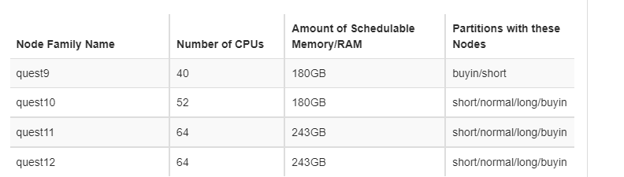

# Quest Tutorial

Writing up a general tutorial for my Quest workflow, which I mostly use when I need to run paralle jobs. I use git/conda to set-up an environment, Globus to transfer files, and the Python multipool to run parallel jobs.

## Set-up

Couple things to do first

### Quest allocation

Join existing allocation: [https://app.smartsheet.com/b/form/797775d810274db5889b5199c4260328](https://app.smartsheet.com/b/form/797775d810274db5889b5199c4260328)

Request new allocation: [https://app.smartsheet.com/b/form/86d88375bd7345439bd391d8184b6ea0](https://app.smartsheet.com/b/form/86d88375bd7345439bd391d8184b6ea0)

When everything is working, you should have an account# (PXXXXX)

### Globus

Activating quest endpoint: [https://services.northwestern.edu/TDClient/30/Portal/KB/ArticleDet?ID=1962](https://services.northwestern.edu/TDClient/30/Portal/KB/ArticleDet?ID=1962)

Activating personal endpoint: [https://www.globus.org/globus-connect-personal](https://www.globus.org/globus-connect-personal)

## Connecting to Quest

### Connecting to log-node

I use SSH to connect. I can't remember if there was anymore set-up than this, but I believe once you're granted allocation you can use `ssh NETID@quest.northwestern.edu`

### Transfering scripts

I suggest using git to clone code onto quest. Git comes preinstalled on the log-in nodes, so `git clone REPO.git` ought to work out of the box.

### Transfering larger files

I use Globus to transfer files. See set-up for there, then I use web GUI [app.globus.org](app.globus.org)

## Submitting jobs on quest

### Submission script

Submit submission script with `sbatch XXX.sh`. Make sure your partition/job length/memory usage/num_cores all "match up": 

See sample submission script for exact make-up of script.

### Checking on jobs

`squeue -u NETID` for job status

`scancel JOBID` to cancel job

`seff JOBID` for memory usage of completed job

`sacct -X` for status of all jobs over last week or so

